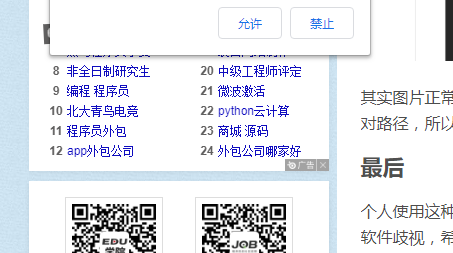

1、IoC容器的初始化包括BeanDefinition的Resource定位、加载、注册三个基本过程

2、IoC容器的注解
	(a)类级别的注解
		@Component、@Repository、@Controller、@Service以及Java EE6的@ManagerBean和@Named
	(b)类内部的注解
		@Autowired、@Value、@Resource以及与EJB、WebService相关的注解
		

3、管理Bean依赖关系的方式：
	(a)显式管理：通过BeanDefinition的属性值和构造方法实现Bean依赖关系管理
	(b)autowiring ：自动装配功能
		(1)对Bean的属性调用getBean方法，完成依赖Bean的初始化和依赖注入
		(2)将依赖Bean的属性引用设置到被依赖的Bean属性上
		(3)将依赖Bean的名称和被依赖Bean的名称存储在IOC容器的集合中